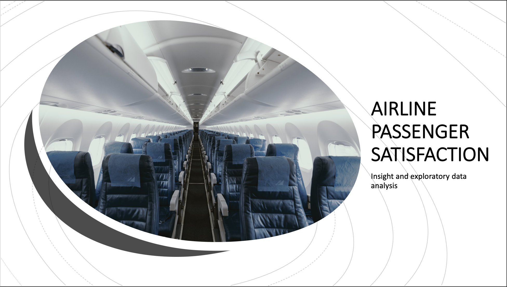

# Airline-Passenger-Satisfaction

Maven Analytics - Airline passenger satisfaction - Insight and exploratory data analysis

Fos this project, I was given a data set with customer satisfaction scores from 120,000+ airline passengers, including additional information about each passenger, their flight, and type of travel, as well as ther evaluation of different factors like cleanliness, comfort, service, and overall experience.

Main objective of this project is to draw insight from the dataset, explore the data and createa a dashboard with customer sentiment of Maven airline's services. Identify areas that the airline is strong and areas that needs a lot of attention in terms of improvement. 

Anaylsis tool used in this project is Microsoft Excel while utilizing the use of pivot table, charts and formulas (IF, CountIF and SumIF).

# The Dataset
Customer satisfaction scores from 120,000+ airline passengers, including additional information about each passenger, their flight, and type of travel, as well as ther evaluation of different factors like cleanliness, comfort, service, and overall experience.

# Analysis

Link to dataset: https://github.com/gelmendozzza/Airline-Passenger-Satisfaction/blob/main/airline%20passenger%20satisfaction%20copy.xlsx

# Key insights and recommendations

-Demographics of Maven Airline passenger consist of 45% Middle age (age bracket of 30-50yrs old) and 48% of its total customer flew business class 

-Overall passenger satisfaction is only 43.5% which gives the airline a net promoter score(NPS) of -13

-39% of returning customers is satisfied with Maven Airline's overall service, while only 4% from first timers or new customers

-Three of the best services the airline provides are the following(In order): In-flight service, Baggage Handling and Seat comfort

-Three buttom most rated are the following: In-flight Wi-fi service, Ease of online booking and Gate location. Recommended strategy is to improve Maven Airline's overall technology with wi-fi service and use of online booking to increase its customer satisfaction on these services, in addition to better selection of gate location for more satisfied customers
